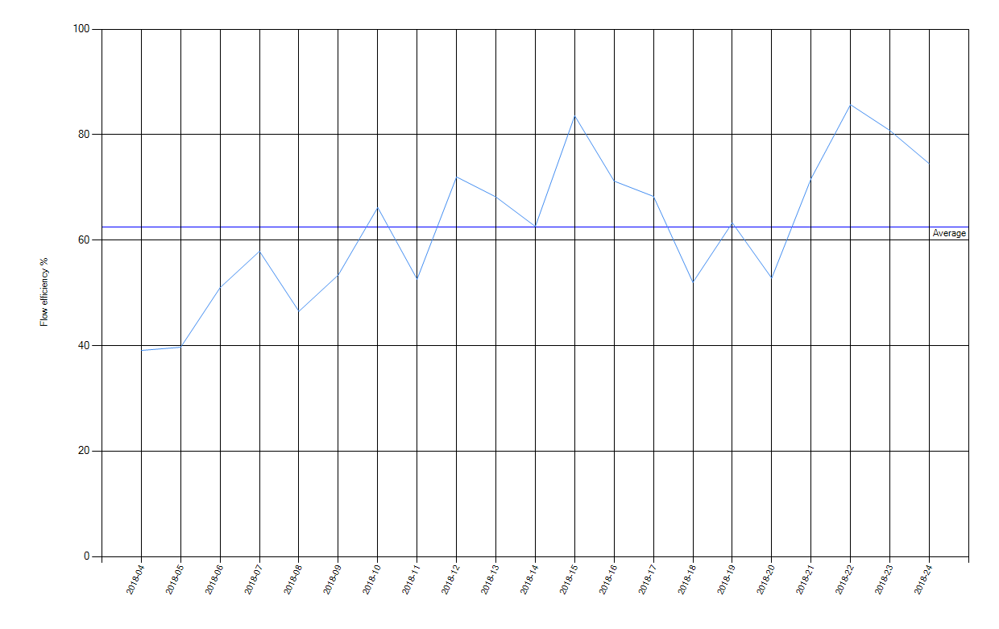
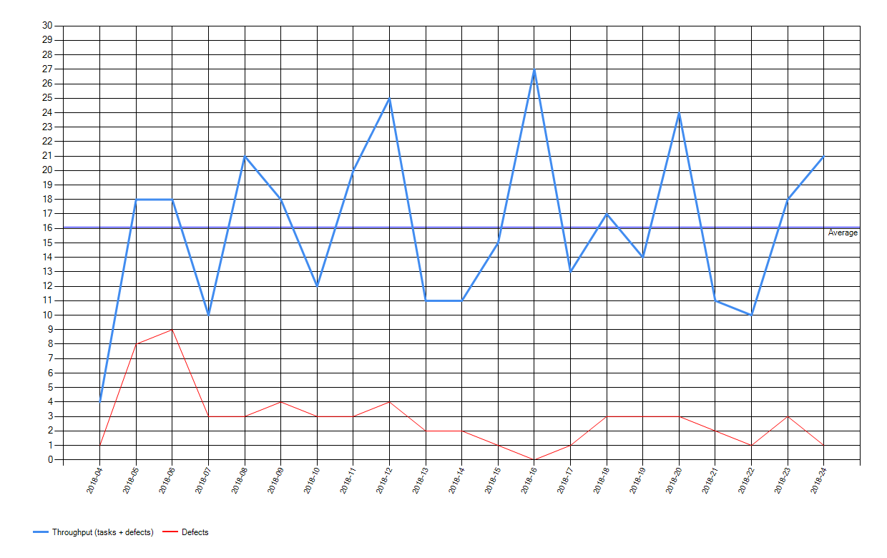
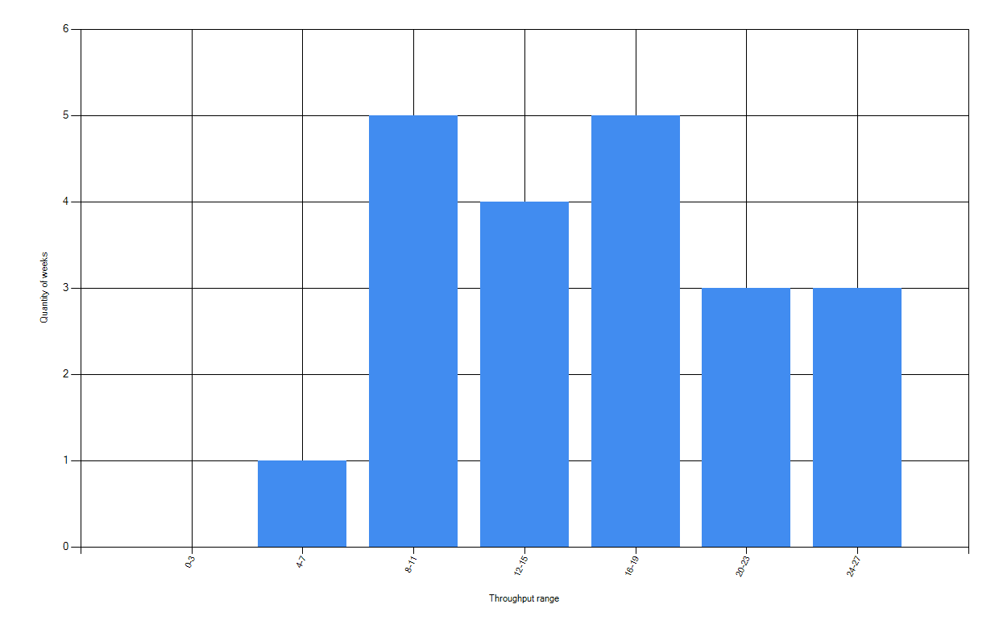
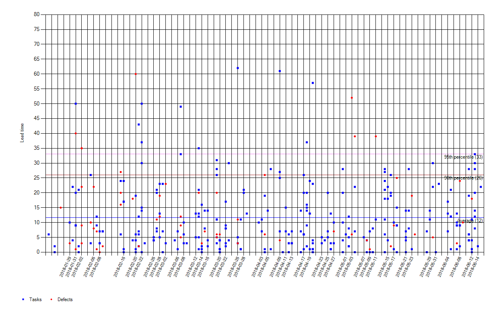
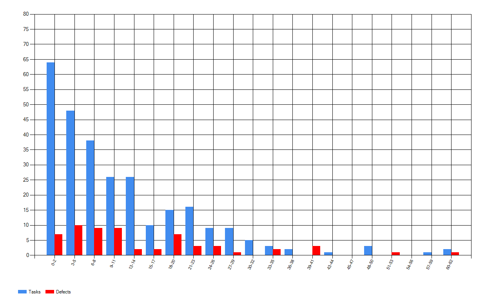
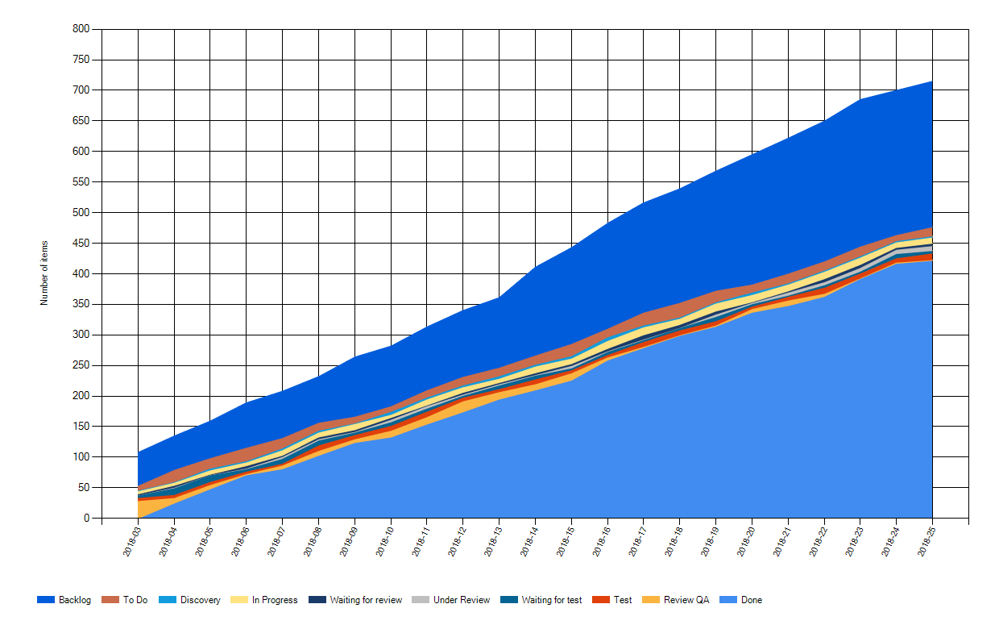

# JiraKanbanMetrics
Extract Kanban metrics from Jira Agile boards using the REST API

# Quick start step-bystep
## Step 1: Generate a configuration file

`JiraKanbanMetrics.exe configure --ConfigFile config.xml --JiraUsername MYUSER --JiraInstanceBaseAddress https://jira.YOURCOMPANY.com/jira/ --BoardId 123456`

This will prompt for your Jira password:

```
Enter the Jira password for user 'MYUSER':
*********
Configuration file generated at: config.xml
```

**IMPORTANT:** Your password will be stored in an encrypted form using a single DES encryption and a hard-coded encryption key. For optimal security, you can opt to avoid storing your password by using the `--NoStorePassword` option.

## Step 2: Edit the configuration file
Edit the generated `config.xml` file, which should look like this:
```xml
<?xml version="1.0" encoding="utf-8"?>
<JiraKanbanConfig>
  <JiraInstanceBaseAddress>https://jira.YOURCOMPANY.com/jira/</JiraInstanceBaseAddress>
  <JiraUsername>MYUSER</JiraUsername>
  <JiraPassword>4an3OGlEUd2Xr31U/w5Dhy0U0QV36LKs</JiraPassword>
  <BoardId>123456</BoardId>
  <QuickFilters></QuickFilters>
  <DefectIssueTypes>Defect</DefectIssueTypes>
  <IgnoredIssueTypes></IgnoredIssueTypes>
  <IgnoredIssueKeys></IgnoredIssueKeys>
  <QueueColumns>To Do</QueueColumns>
  <CommitmentStartColumns>To Do</CommitmentStartColumns>
  <InProgressStartColumns>In progress</InProgressStartColumns>
  <DoneColumns>Done</DoneColumns>
  <BacklogColumnName>Backlog</BacklogColumnName>
  <MonthsToAnalyse>5</MonthsToAnalyse>
</JiraKanbanConfig>
```
Please refer to the "Configuration File" section for the details about each configuration option.

## Step 3: Run it

`JiraKanbanMetrics.exe generate --ConfigFile config.xml`

This will connect to your Jira instance, extract metrics and generate a set of ".png" files on your current working directory.

# Sample generated charts

## FlowEfficiencyChart.png

## WeeklyThroughputChart.png

## WeeklyThroughputHistogramChart.png

## LeadTimeControlChart.png

## LeadTimeHistogramChart.png

## CumulativeFlowDiagramChart.png


